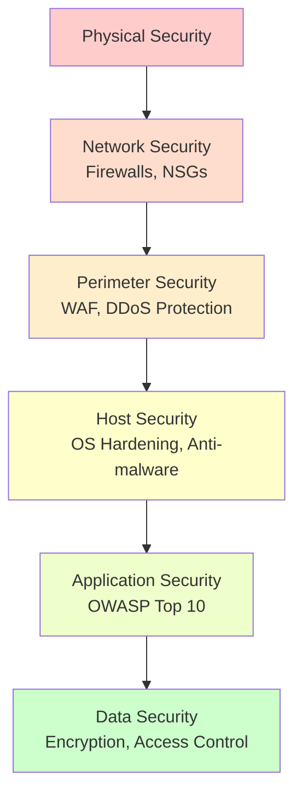

# Security Architecture Design & Zero Trust
Security architecture design principles and the zero-trust model applied to this stack. Load this when designing a system's security posture.

## Security Architecture Design

### Defense in Depth Strategy

Implement multiple layers of security controls so that if one layer fails, others still provide protection.



### Security Layers

**Layer 1: Physical Security**
- Data center access controls
- Biometric authentication
- Surveillance systems
- Environmental controls

**Layer 2: Network Security**
```csharp
// Azure Network Security Groups (NSG)
// File: infrastructure/network-security.bicep

resource nsg 'Microsoft.Network/networkSecurityGroups@2023-04-01' = {
  name: 'application-nsg'
  location: location
  properties: {
    securityRules: [
      {
        name: 'AllowHTTPS'
        properties: {
          protocol: 'Tcp'
          sourcePortRange: '*'
          destinationPortRange: '443'
          sourceAddressPrefix: '*'
          destinationAddressPrefix: '*'
          access: 'Allow'
          priority: 100
          direction: 'Inbound'
        }
      }
      {
        name: 'DenyAllInbound'
        properties: {
          protocol: '*'
          sourcePortRange: '*'
          destinationPortRange: '*'
          sourceAddressPrefix: '*'
          destinationAddressPrefix: '*'
          access: 'Deny'
          priority: 4096
          direction: 'Inbound'
        }
      }
    ]
  }
}
```

**Layer 3: Perimeter Security**
```csharp
// Web Application Firewall (WAF)
// Azure Front Door with WAF

resource wafPolicy 'Microsoft.Network/FrontDoorWebApplicationFirewallPolicies@2022-05-01' = {
  name: 'application-waf'
  location: 'Global'
  properties: {
    policySettings: {
      enabledState: 'Enabled'
      mode: 'Prevention'
    }
    managedRules: {
      managedRuleSets: [
        {
          ruleSetType: 'Microsoft_DefaultRuleSet'
          ruleSetVersion: '2.1'
        }
        {
          ruleSetType: 'Microsoft_BotManagerRuleSet'
          ruleSetVersion: '1.0'
        }
      ]
    }
  }
}
```

**Layer 4: Host Security**
- OS hardening and patching
- Anti-malware and EDR
- Host-based firewalls
- Intrusion detection systems

**Layer 5: Application Security**
- Refer to `software-security.md` and `api-security.md`
- OWASP Top 10 compliance
- Secure coding practices
- Input validation and output encoding

**Layer 6: Data Security**
```csharp
// Encryption at rest and in transit
// File: {ApplicationName}.Data/DataContext.cs

public sealed class DataContext : DbContext
{
    protected override void OnConfiguring(DbContextOptionsBuilder optionsBuilder)
    {
        // Connection string with encryption
        optionsBuilder.UseNpgsql(
            "Host=server;Database=db;Username=user;Password=pass;SSL Mode=Require;Trust Server Certificate=false",
            options =>
            {
                options.EnableRetryOnFailure(maxRetryCount: 3);
            });
    }

    protected override void OnModelCreating(ModelBuilder modelBuilder)
    {
        base.OnModelCreating(modelBuilder);

        // Encrypt sensitive columns
        modelBuilder.Entity<User>()
            .Property(u => u.SocialSecurityNumber)
            .HasConversion(
                v => EncryptionService.Encrypt(v),
                v => EncryptionService.Decrypt(v));
    }
}
```

---

## Zero Trust Architecture

### Zero Trust Principles

1. **Verify Explicitly** - Always authenticate and authorize
2. **Use Least Privilege** - Limit access with Just-In-Time and Just-Enough-Access
3. **Assume Breach** - Minimize blast radius, segment access

### Zero Trust Implementation

```csharp
// File: {ApplicationName}.Services.API/Program.cs

var builder = WebApplication.CreateBuilder(args);

// 1. Verify Explicitly - Strong authentication
builder.Services.AddAuthentication(JwtBearerDefaults.AuthenticationScheme)
    .AddJwtBearer(options =>
    {
        options.Authority = builder.Configuration["Auth:Authority"];
        options.Audience = builder.Configuration["Auth:Audience"];
        options.RequireHttpsMetadata = true;

        options.TokenValidationParameters = new TokenValidationParameters
        {
            ValidateIssuer = true,
            ValidateAudience = true,
            ValidateLifetime = true,
            ValidateIssuerSigningKey = true,
            ClockSkew = TimeSpan.Zero
        };
    });

// 2. Use Least Privilege - Fine-grained authorization
builder.Services.AddAuthorization(options =>
{
    options.AddPolicy("ReadBudgets", policy =>
        policy.RequireClaim("permission", "budgets:read"));

    options.AddPolicy("WriteBudgets", policy =>
        policy.RequireClaim("permission", "budgets:write"));

    options.AddPolicy("DeleteBudgets", policy =>
        policy.RequireClaim("permission", "budgets:delete")
              .RequireRole("Admin"));
});

// 3. Assume Breach - Network segmentation, minimal trust
builder.Services.AddHttpClient<ExternalServiceClient>()
    .ConfigurePrimaryHttpMessageHandler(() => new HttpClientHandler
    {
        ServerCertificateCustomValidationCallback = (message, cert, chain, errors) =>
        {
            // Validate certificate
            return errors == SslPolicyErrors.None;
        }
    })
    .AddStandardResilienceHandler(); // Circuit breaker, retries

var app = builder.Build();

// Enforce HTTPS
app.UseHttpsRedirection();

// Require authentication for all endpoints
app.MapGet("/api/budgets", async (IQueryHandler handler) =>
{
    // Handler implementation
})
.RequireAuthorization("ReadBudgets");

app.Run();
```

---

