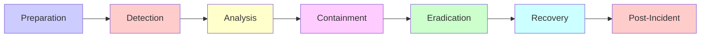

# Incident Response & Disaster Recovery
The incident-response lifecycle and disaster-recovery objectives, backups and restore testing. Load this when planning or executing incident handling or DR.

## Incident Response Planning

### Incident Response Process



### Incident Response Plan

```markdown
# Incident Response Plan

### 1. Preparation
- [ ] Incident response team identified
- [ ] Contact list maintained
- [ ] Tools and access ready
- [ ] Communication channels established
- [ ] Backup and recovery procedures tested

### 2. Detection
- [ ] Monitoring alerts configured
- [ ] Log aggregation in place
- [ ] Anomaly detection enabled
- [ ] User reporting mechanism

### 3. Analysis
- [ ] Determine scope and impact
- [ ] Identify affected systems
- [ ] Classify incident severity
- [ ] Document timeline

### 4. Containment
- [ ] Short-term containment (isolate affected systems)
- [ ] Long-term containment (patch vulnerabilities)
- [ ] Preserve evidence

### 5. Eradication
- [ ] Remove malware/unauthorized access
- [ ] Close vulnerabilities
- [ ] Strengthen defenses

### 6. Recovery
- [ ] Restore systems from clean backups
- [ ] Verify system integrity
- [ ] Monitor for recurrence

### 7. Post-Incident
- [ ] Incident report
- [ ] Lessons learned
- [ ] Update procedures
- [ ] Training and awareness
```

### Incident Logging

```csharp
/// <summary>
/// Security incident logging and tracking.
/// </summary>
public sealed class SecurityIncidentLogger
{
    private readonly ILogger<SecurityIncidentLogger> _logger;
    private readonly DataContext _dataContext;

    public async Task LogIncidentAsync(
        SecurityIncidentType incidentType,
        string description,
        SecurityIncidentSeverity severity,
        CancellationToken cancellationToken = default)
    {
        var incident = new SecurityIncident
        {
            IncidentId = Guid.NewGuid(),
            IncidentType = incidentType,
            Description = description,
            Severity = severity,
            OccurredAt = DateTimeOffset.UtcNow,
            Status = IncidentStatus.Open
        };

        _dataContext.SecurityIncidents.Add(incident);
        await _dataContext.SaveChangesAsync(cancellationToken);

        _logger.LogCritical(
            "[SECURITY INCIDENT] {IncidentType} - Severity: {Severity} - {Description}",
            incidentType, severity, description);

        // Alert security team
        await NotifySecurityTeamAsync(incident, cancellationToken);
    }

    private async Task NotifySecurityTeamAsync(
        SecurityIncident incident,
        CancellationToken cancellationToken)
    {
        // Send alerts via email, SMS, PagerDuty, etc.
    }
}

public enum SecurityIncidentType
{
    UnauthorizedAccess,
    DataBreach,
    MalwareDetected,
    DDoSAttack,
    PrivilegeEscalation,
    SuspiciousActivity
}

public enum SecurityIncidentSeverity
{
    Low,
    Medium,
    High,
    Critical
}

public enum IncidentStatus
{
    Open,
    InProgress,
    Contained,
    Eradicated,
    Recovered,
    Closed
}
```

---

## Disaster Recovery and Business Continuity

### Disaster Recovery Plan

```markdown
# Disaster Recovery Plan

## Recovery Objectives
- **RTO (Recovery Time Objective):** 4 hours
- **RPO (Recovery Point Objective):** 1 hour

## Backup Strategy
- **Full Backup:** Daily at 2 AM UTC
- **Incremental Backup:** Every 6 hours
- **Retention:** 30 days

## Recovery Procedures

### Database Recovery
1. Identify failure type
2. Locate latest valid backup
3. Restore database from backup
4. Apply transaction logs
5. Verify data integrity
6. Switch DNS to recovery instance

### Application Recovery
1. Deploy application to DR environment
2. Update configuration
3. Verify connectivity to database
4. Run health checks
5. Switch traffic via load balancer

## Testing
- **Tabletop exercises:** Quarterly
- **Full DR drill:** Annually
```

### Backup Automation

```csharp
/// <summary>
/// Automates database backups.
/// </summary>
public sealed class BackupService
{
    private readonly IConfiguration _configuration;
    private readonly ILogger<BackupService> _logger;
    private readonly BlobServiceClient _blobClient;

    public async Task CreateBackupAsync(CancellationToken cancellationToken = default)
    {
        var timestamp = DateTimeOffset.UtcNow.ToString("yyyyMMdd-HHmmss");
        var backupFileName = $"backup-{timestamp}.bak";

        _logger.LogInformation("Starting database backup: {FileName}", backupFileName);

        // Create database backup
        var connectionString = _configuration.GetConnectionString("DefaultConnection");
        await using var connection = new NpgsqlConnection(connectionString);
        await connection.OpenAsync(cancellationToken);

        // Backup logic here...

        // Upload to Azure Blob Storage
        var containerClient = _blobClient.GetBlobContainerClient("backups");
        await containerClient.CreateIfNotExistsAsync(cancellationToken: cancellationToken);

        var blobClient = containerClient.GetBlobClient(backupFileName);
        await using var fileStream = File.OpenRead(backupFileName);
        await blobClient.UploadAsync(fileStream, cancellationToken);

        _logger.LogInformation("Backup completed: {FileName}", backupFileName);

        // Clean up old backups (retain 30 days)
        await CleanupOldBackupsAsync(containerClient, cancellationToken);
    }

    private async Task CleanupOldBackupsAsync(
        BlobContainerClient containerClient,
        CancellationToken cancellationToken)
    {
        var cutoffDate = DateTimeOffset.UtcNow.AddDays(-30);

        await foreach (var blob in containerClient.GetBlobsAsync(cancellationToken: cancellationToken))
        {
            if (blob.Properties.CreatedOn < cutoffDate)
            {
                await containerClient.DeleteBlobAsync(blob.Name, cancellationToken: cancellationToken);
                _logger.LogInformation("Deleted old backup: {BlobName}", blob.Name);
            }
        }
    }
}
```

---
