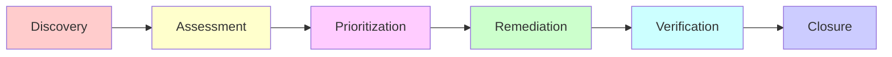

# Security Risk Assessment & Vulnerability Management
Risk scoring and the vulnerability management lifecycle (scanning, triage, remediation SLAs). Load this when assessing risk or handling a finding.

## Security Risk Assessment

### Risk Assessment Matrix

| Impact → | Low | Medium | High | Critical |
|----------|-----|--------|------|----------|
| **Likelihood ↓** |  |  |  |  |
| **Almost Certain** | Medium | High | Critical | Critical |
| **Likely** | Low | Medium | High | Critical |
| **Possible** | Low | Medium | High | High |
| **Unlikely** | Low | Low | Medium | High |
| **Rare** | Low | Low | Low | Medium |

### Risk Assessment Process

```csharp
/// <summary>
/// Security risk assessment and tracking.
/// </summary>
public sealed class SecurityRiskAssessment
{
    public Guid RiskId { get; init; }
    public string RiskName { get; init; } = string.Empty;
    public string Description { get; init; } = string.Empty;
    public RiskLikelihood Likelihood { get; init; }
    public RiskImpact Impact { get; init; }
    public RiskLevel CalculatedRiskLevel => CalculateRiskLevel();
    public string Mitigation { get; init; } = string.Empty;
    public RiskStatus Status { get; init; }
    public Guid OwnerId { get; init; }
    public DateTimeOffset IdentifiedDate { get; init; }
    public DateTimeOffset? MitigatedDate { get; init; }

    private RiskLevel CalculateRiskLevel()
    {
        var score = (int)Likelihood * (int)Impact;

        return score switch
        {
            >= 15 => RiskLevel.Critical,
            >= 10 => RiskLevel.High,
            >= 5 => RiskLevel.Medium,
            _ => RiskLevel.Low
        };
    }
}

public enum RiskLikelihood
{
    Rare = 1,
    Unlikely = 2,
    Possible = 3,
    Likely = 4,
    AlmostCertain = 5
}

public enum RiskImpact
{
    Low = 1,
    Medium = 2,
    High = 3,
    Critical = 4
}

public enum RiskLevel
{
    Low,
    Medium,
    High,
    Critical
}

public enum RiskStatus
{
    Identified,
    Analyzing,
    Mitigating,
    Monitoring,
    Closed
}
```

---

## Vulnerability Management

### Vulnerability Lifecycle



### Vulnerability Tracking

```csharp
/// <summary>
/// Tracks security vulnerabilities.
/// </summary>
public sealed class SecurityVulnerability
{
    public Guid VulnerabilityId { get; init; }
    public string Title { get; init; } = string.Empty;
    public string Description { get; init; } = string.Empty;
    public VulnerabilitySeverity Severity { get; init; }
    public string AffectedComponent { get; init; } = string.Empty;
    public string CVEId { get; init; } = string.Empty; // Common Vulnerabilities and Exposures
    public VulnerabilityStatus Status { get; init; }
    public string Remediation { get; init; } = string.Empty;
    public DateTimeOffset DiscoveredDate { get; init; }
    public DateTimeOffset? RemediatedDate { get; init; }
    public Guid AssignedTo { get; init; }
}

public enum VulnerabilitySeverity
{
    Low,       // CVSS 0.1-3.9
    Medium,    // CVSS 4.0-6.9
    High,      // CVSS 7.0-8.9
    Critical   // CVSS 9.0-10.0
}

public enum VulnerabilityStatus
{
    Open,
    InProgress,
    Remediated,
    Verified,
    Closed,
    Accepted // Risk accepted by management
}
```

---

